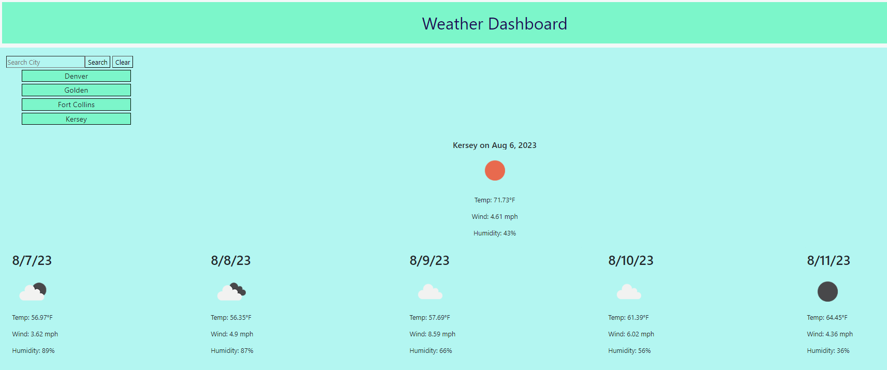

# Get-Weather

## Description
This is a weather dashboard that was created to show the current date and weather forecast as well as the forecast for the next 5 days. I learned about APIs and how to utilize them to display data from third-party websites and how to use query parameters to get the information I want. I learned about reading the documentation to find parameters to get the information that I needed. 

## Usage
To use the weather dashboard one has to open up the website. Here you have to input a city name into the search box. Once you click "search", the current date is displayed as well as the current weather. You'll also see a forecast showing for the next 5 days. I had to choose a certain time of day to display, so each future forecast is set for noon. Each city is saved so that when you click a past city, the data is displayed again. You can hit clear to get rid of the search results. 

## Credits
Thank you to my DU professor and TAs. Thank you to my fellow students for asking and answering questions. I used the Open Weather API and they had great documentation. MDN and W3Schools was very helpful as well as stackOverflow when I need additional questions answered, particularly when displaying the weather icons as images.  

Deployed Site: https://alester77.github.io/Get-Weather/

